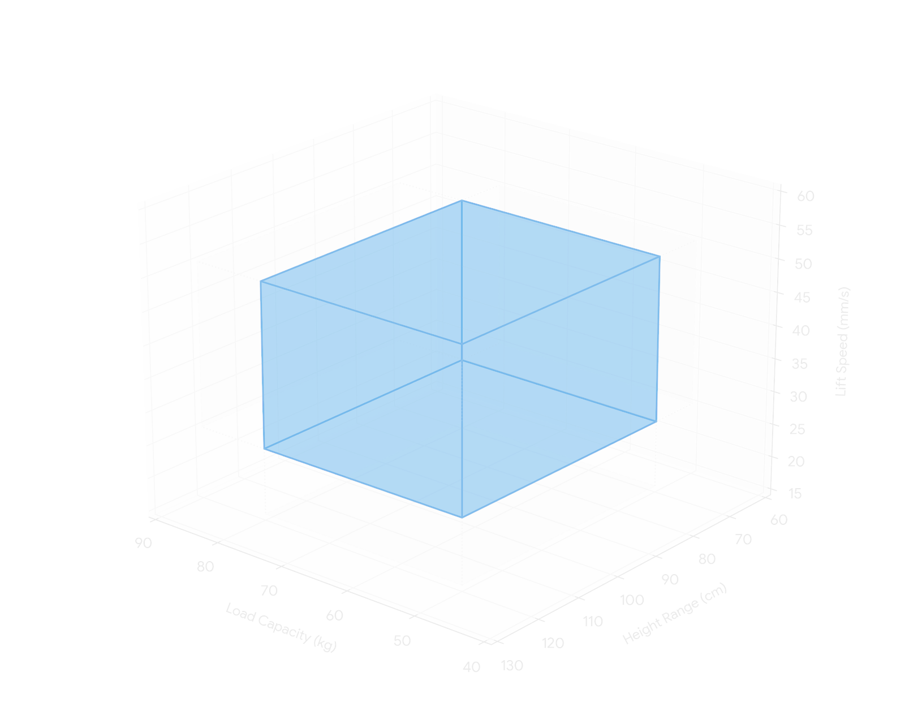
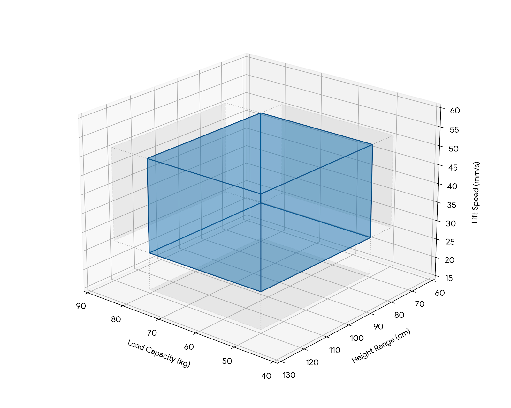

import ExternalLink from "../../../components/ExternalLink.astro";

### Target Audience

- Vibecoders
- Software Engineers

---

## Playing the Long Game

Creating a successful product in the age of LLMs has shifted focus from implementation toward deciding what to build.
Choosing or modifying a list of high-level requirements and delivering fast plays a critical role in determining whether a product succeeds.

Meanwhile, the market has grown far more competitive.
Almost all low-hanging fruit has been picked.
Finding potentially profitable project opportunities is harder, and your project development strategy needs to be optimized for the long game.

Spec-Driven Development introduces a certain initial overhead, but promises a more optimized approach over the long run.
The purpose of Spec-Driven Development is to place requirements at the center of development — defining, managing, and building loops and pipelines around them while AI agents do the rest.

Consider the product development strategy below.
Notice that after finding an opportunity, requirements play the critical role.


## Navigating the Multidimensional Space

Imagine you suddenly wake up in outer space, but there are more than three dimensions.
You have a limited food and oxygen supply (money and time).
Do you decide consciously, or do you let the Force guide you?
Unless you have Jedi powers, you better channel your inner Ryland Grace and start sciencing your way through the problem.
Here's what I'd do:

1. **Identify dimensions** — how many dimensions are there? 3, 4, 20? How do you move in those dimensions? Are those dimensions coupled? Are there any traps? (understanding the domain, available resources, legal constraints, technical constraints).
2. **Define what you want to find** — life? a planet to live on? what is your mission? (building access to users, maximizing profits).
3. **Narrow down the search area** — search relatively close to stars. (defining requirements, setting scope boundaries)
4. **Explore the space** — find candidates. What is the best candidate? (creating 1–3 prototypes with different trade-offs)
5. **Choose the best candidate and commit** — choose a planet and land there (refining the solution).

Searching for a new product resembles navigating a multidimensional space.
Your job is to narrow down the space and prepare your AI agent to land.

### Multiverse

A complex product rarely exists as a single, isolated universe.
It operates within a multiverse.
Major features, external integrations, and subsystems each form their own distinct universes, connected by portals ([contracts](#contracts)).

Meanwhile, cross-cutting concerns like security, logging, and error handling act as universal laws governing every realm in the system.
And eventually, you have to open portals to the outside world for external visitors... some of whom will inevitably be hostile.

## Why Agents Play It Safe (or Break Everything)

It's easy to tell an agent to fly somewhere (generate the code), but AI agents lose memory every time they go to "sleep" (when you start a new conversation or clear the context).
Without memory, they are too defensive about their actions to avoid destroying your spaceship, and sometimes too aggressive when a requirement couldn't be guessed from the code.
Agents have to rediscover the project's multidimensional solution space, but they usually don't have enough information to do it properly.

It's a knowledge problem, not an intelligence problem — a new developer joining an existing, poorly documented project is also defensive (or introduces a regression) for the same reason, and it takes time for them to become truly productive.
An overly strict solution space yields suboptimal results, while an unconstrained one leads to undesirable outcomes.
A solution space needs to be properly managed, and an agent needs to know when to trust it.

Does simply providing a spec to an agent yield higher quality code?
It depends: an agent may use that extra knowledge, but it will be constrained by the existing codebase — an agent shouldn't change the entire architecture out of the blue.
Specs, however, can be used to build workflows around them.
For example, you can use them to find interesting corner cases, improve test suite quality, or prevent moving a specification into an inconsistent state.

## How to Represent a Solution Space

Suppose we're designing a standing desk.
The valid solution space is a 3D volume bounded by six requirements.

<span class="light:sl-hidden print:hidden sl-block"></span>
<span class="dark:sl-hidden print:block sl-block"></span>

If you ask an AI agent to reverse-engineer those six boundary requirements by looking at a single concrete implementation, it will mistake a single point inside the space for the entire bounding box:

**Single point inside the solution space example**
```ts
export const deskOne: DeskSpec = {
  loadCapacityKg: 65,
  minHeightCm: 62,
  maxHeightCm: 127,
  liftSpeedMmS: 37.5,
};
```

**Reverse-engineered requirements**
```
1. The desk MUST support a static load of at least 65 kg across the entire height range without structural deflection exceeding manufacturer tolerances.
2. The desk MUST lower to a minimum surface height of 62 cm or less.
3. The desk MUST raise to a maximum surface height of 127 cm or more.
4. The desk MUST travel between its minimum and maximum height at a sustained lift speed of at least 37.5 mm/s while carrying the rated load.
5. The desk MUST complete a full 65 cm stroke in no more than 17.5 seconds under rated load.
6. The desk MUST maintain the rated lift speed and load capacity concurrently, without derating one to achieve the other.
```

So, how do we properly document and manage a solution space?

### Plain-Text List of Requirements

A straightforward list of natural-language requirements.

**Example**

```
1. The load capacity MUST be larger than 50 kg.
2. The load capacity MUST be smaller than 80 kg.
3. The height MUST adjust lower than 70 cm.
4. The height MUST adjust higher than 120 cm.
5. The lift speed MUST be faster than 25 mm/s.
6. The lift speed MUST be slower than 50 mm/s.
```

**Pros**

- **Highly concise**: Maximum information density with minimal text overhead.
- **Low friction**: Simple and intuitive for humans to read and write.

**Cons**

- **Unstandardized**: Lacks a strict schema, making it difficult to build automated tools or validation loops around.
- **Prone to drift**: Without programmatic enforcement, text easily falls out of sync with the codebase.

### Code Comments

Embedding specifications directly into code comments (such as JSDoc or module headers) places requirements right at the point of implementation.
While human developers historically avoided heavy comments due to comment rot, LLMs are good at keeping inline documentation updated whenever they modify the code.

**Example**

```ts
/**
 * ============================================================================
 *  STANDING DESK
 * ============================================================================
 *
 *                        ┌──────────────────────────────┐
 *          load ───────► │       TABLETOP  (load)       │ ◄─── 50 < load < 80 kg
 *                        └───────┬──────────────┬───────┘
 *                                │              │
 *                                │   ▲          │        height range must
 *          lift ───────► [M]═════╡   │ 120 cm ─ ╞═════   REACH ABOVE 120 cm
 *          motor         [M]═════╡   ¦          ╞═════   (max > 120)
 *                                │   ¦ travel   │
 *        25 < v < 50 mm/s        │   ¦          │        ...and DROP BELOW 70 cm
 *                                │   │  70 cm ─ │        (min < 70)
 *                                │   ▼          │
 *                        ════════╧══════════════╧════════
 *                                 floor
 *
 */
```

**Pros**

- **High locality**: The specification lives right where the code is edited, giving immediate context.
- **Active maintenance**: LLMs update inline comments more reliably than human developers.

**Cons**

- **Scattered and fragmented**: Requirements are split across multiple files.
- **Coupled existence**: Deleting or replacing a concrete solution deletes the boundary definition itself.

### Git Logs and Commit Rationale

Using commit messages and Pull Request descriptions to document specifications.
When code seems arbitrary, developers and AI agents can run `git blame` or inspect commit history to uncover the rationale behind specific constraints.

**Example**

```
feat(desk): create and move a standing desk to the magazine

# Summary

Valid desks form an open 4-D box (all bounds strict, boundaries rejected):

    S = (50, 80) kg × (0, 70) cm × (120, ∞) cm × (25, 50) mm/s

Height is a range: min < 70 cm AND max > 120 cm. (REQ-1..REQ-6)

# Changelog

- Add DeskSpec + isInSolutionSpace() strict-bounds predicate

# Test Plan

- `bun test` — 16 passing: each bound on-boundary (invalid) vs
  just-inside (valid), plus all-dimensions corner cases

# Attachments

- ASCII solution-space diagram in standing-desk-solution-space.ts

# Links

- REQ-1..REQ-6 → standing-desk-solution-space.ts → standing-desk.test.ts
```

**Pros**

- **Zero extra overhead:** Developers and AI agents already write PR descriptions and commit messages as part of standard workflows.
- **Preserves historical intent:** Captures *why* a specific boundary decision was made at the exact time it was introduced.

**Cons**

- **Historical, not stateful:** Represents a point-in-time snapshot. As requirements evolve, old commit logs become stale.
- **High retrieval friction for agents:** Git history isn't part of the agent's active context window. Uncovering constraints requires multi-step tool calls (`git blame`, `git log`) and filtering through unrelated commits.
- **Fragmented across time:** The full specification is scattered across months of commit history rather than consolidated in a single view.

### Executable Tests

Representing a solution space through executable tests that directly assert boundary conditions.

**Example**

```ts
describe("load capacity (50 < x < 80)", () => {
  test("boundary 50 kg is invalid (must be larger)", () => expect(desk({ loadCapacityKg: 50 }).isValid()).toBe(false));
  test("just above 50 kg is valid", () => expect(desk({ loadCapacityKg: 50.01 }).isValid()).toBe(true));
  test("just below 80 kg is valid", () => expect(desk({ loadCapacityKg: 79.99 }).isValid()).toBe(true));
  test("boundary 80 kg is invalid (must be smaller)", () => expect(desk({ loadCapacityKg: 80 }).isValid()).toBe(false));
});
 
describe("height range (min < 70, max > 120)", () => {
  test("min height 70 cm is invalid (must go lower)", () => expect(desk({ minHeightCm: 70 }).isValid()).toBe(false));
  test("min height 69.9 cm is valid", () => expect(desk({ minHeightCm: 69.9 }).isValid()).toBe(true));
  test("max height 120 cm is invalid (must go higher)", () => expect(desk({ maxHeightCm: 120 }).isValid()).toBe(false));
  test("max height 120.1 cm is valid", () => expect(desk({ maxHeightCm: 120.1 }).isValid()).toBe(true));
});
 
describe("lift speed (25 < x < 50)", () => {
  test("boundary 25 mm/s is invalid (must be faster)", () => expect(desk({ liftSpeedMmS: 25 }).isValid()).toBe(false));
  test("just above 25 mm/s is valid", () => expect(desk({ liftSpeedMmS: 25.1 }).isValid()).toBe(true));
  test("just below 50 mm/s is valid", () => expect(desk({ liftSpeedMmS: 49.9 }).isValid()).toBe(true));
  test("boundary 50 mm/s is invalid (must be slower)", () => expect(desk({ liftSpeedMmS: 50 }).isValid()).toBe(false));
});
 
describe("corner cases (multiple dimensions at extremes)", () => {
  test("all values just inside their limits simultaneously → valid", () => {
    const d = desk({ loadCapacityKg: 50.01, minHeightCm: 69.99, maxHeightCm: 120.01, liftSpeedMmS: 25.01 });
    expect(d.isValid()).toBe(true);
  });
 
  test("all values at the opposite inner extremes → valid", () => {
    const d = desk({ loadCapacityKg: 79.99, minHeightCm: 0.01, maxHeightCm: 200, liftSpeedMmS: 49.99 });
    expect(d.isValid()).toBe(true);
  });
 
  test("every value exactly on its boundary → invalid", () => {
    const d = desk({ loadCapacityKg: 50, minHeightCm: 70, maxHeightCm: 120, liftSpeedMmS: 25 });
    expect(d.isValid()).toBe(false);
  });
 
  test("one failing dimension invalidates an otherwise-extreme-but-valid desk", () => {
    const d = desk({ loadCapacityKg: 50.01, minHeightCm: 69.99, maxHeightCm: 120.01, liftSpeedMmS: 50 });
    expect(d.isValid()).toBe(false);
  });
});
```

**Pros**

- **Automated enforcement:** Provides instant, programmatic feedback.
- **Zero ambiguity:** Eliminates natural-language interpretation errors.

**Cons**

- **High noise:** Business constraints get buried among hundreds of other tests.
- **Strictly binary:** Asserts pass/fail criteria well, but struggles to model non-binary constraints (`SHOULD`, `MAY`, `RECOMMENDED` requirements).
- **Missing rationale ("What" vs. "Why"):** Verifies that a boundary exists, but fails to explain the underlying business rationale.
- **Tight coupling to the test stack:** The specification is bound to a specific language, test runner, and assertion library.
- **Inaccessible to most stakeholders:** Non-technical domain experts cannot easily review, audit, or approve specs.

### Gherkin — Language used in Behavior Driven Development

Gherkin uses structured natural language (`Given`/`When`/`Then`) to define behavioral scenarios.
Developed for Behavior-Driven Development (BDD).

**Example**

```gherkin
Feature: Standing Desk Edge Case Validation

  Scenario Outline: Verify operation strictly inside boundaries
    Given a standing desk loaded with <load> kg
    And the desk target height is <height> cm
    When operating at a speed of <speed> mm/s
    Then the desk operates strictly within nominal specifications

    Examples: Valid Boundary Extremes
      | load  | height | speed |
      | 50.01 | 95     | 37.5  |
      | 79.99 | 95     | 37.5  |
      | 65    | 69.9   | 37.5  |
      | 65    | 120.1  | 37.5  |
      | 65    | 95     | 25.01 |
      | 65    | 95     | 49.99 |
```

**Pros**

- **Human-readable and tech-agnostic**: Scenarios are written in domain-specific natural language, decoupled from underlying frameworks.
- **Single source of truth**: Combines functional requirements and test scenarios into a single specification artifact.
- **Established ecosystem**: Supported by mature tooling (Cucumber, Gherkin).

**Cons**

- **Brittle glue-code layer**: Tooling only generates empty stubs.
- **Focuses on "what," not "why"**: Captures scenario inputs and outputs without recording underlying business rationale.
- **Struggles with non-binary rules**: Advisory or soft requirements (SHOULD, MAY) cannot be easily verified in deterministic scenarios.

### Spec-Driven Development

There is no official industry machine-friendly standard for spec files (or at least I haven't found one). During my experiments with SDD, I ended up using requirement tables as tooling and human-friendly specification files.

**Example**

| ID | Statement | Reason |
|----|-----------|--------|
| `DESK__LOAD__MIN` | The load capacity MUST be larger than 50 kg. | A typical workstation setup exceeds lighter loads; 50 kg is the functional minimum. |
| `DESK__LOAD__MAX` | The load capacity MUST be smaller than 80 kg. | Capacity above 80 kg requires a heavier motor class, exceeding cost/weight budgets. |
| `DESK__HEIGHT__LOWER_BOUND` | The height MUST adjust lower than 70 cm. | Supports ergonomic sitting postures for shorter users (requires positions below 70 cm). |
| `DESK__HEIGHT__UPPER_BOUND` | The height MUST adjust higher than 120 cm. | Supports ergonomic standing postures for taller users (requires positions above 120 cm). |
| `DESK__LIFT_SPEED__MIN` | The lift speed MUST be faster than 25 mm/s. | Slower transitions discourage sitting/standing changes, defeating product purpose. |
| `DESK__LIFT_SPEED__MAX` | The lift speed MUST be slower than 50 mm/s. | Faster movement creates pinch/collision safety hazards and excessive motor noise. |

**Pros**

- **Captures "What" and "Why"**
- **High information density:** Defines the solution space concisely.
- **Tech-agnostic:** Independent of implementation or testing frameworks.

**Cons**

- **Multi-layer translation pipeline:** Introduces another indirection (e.g., `Prompt → Spec → (optionally) Acceptance Scenarios → Tests → Implementation`).
- **Requires custom tooling:** Ideally, connections between requirements and test cases should be programmatically enforced.


## What is the Purpose of a Specification?

In Spec-Driven Development (SDD), the purpose of a specification is to concisely define the boundaries of a solution space for both AI agents and human developers.
The codebase (or system) is simply one concrete solution residing within that solution space.

What is a spec, then?

Suggested definition:

> **In the context of Spec-Driven Development, a specification is a description of a system's valid solution space.**

## What Belongs in a Spec?

While there is no single universal standard for spec files, during my experiments with SDD, three concepts emerged: Requirements, Acceptance Scenarios, and Contracts.

### Requirements

Requirements are the simplest way to define the internal boundaries of a solution space.
They fall into two categories based on strictness:

- **Constraints (`MUST`, `MUST NOT`):** Hard, non-negotiable boundaries that define valid system states.
- **Suggestions (`SHOULD`, `SHOULD NOT`, `MAY`):** Soft guidelines, default behaviors, and trade-off preferences.

> The industry standard for these keywords is
> <ExternalLink href="https://datatracker.ietf.org/doc/html/rfc2119" />,
> which gives precise, non-ambiguous meaning to `MUST`, `MUST NOT`, `SHOULD`, `SHOULD NOT`, and `MAY`.

Requirements can also carry workflow metadata (e.g., `Modified At`, `Reviewed At`, `Owner`, `Status`).

### Acceptance Scenarios

Because LLMs can miss requirements or introduce regressions, requirements must be programmatically enforced using a test suite.
A robust test suite was one of the primary enablers of Bun's complete rewrite from Zig to Rust,
described in <ExternalLink href="https://bun.com/blog/bun-in-rust" /> — a rewrite so massive that AI agents burned ~$165,000 in token costs.

Acceptance scenarios define testing flows in plain language.
When expressing ideas as requirements subtle details can be lost or be inconsistent, and testing scenarios help bring those issues to light.
Testing scenarios, however, effectively duplicate information already present in requirements.

If requirements are an abstraction over implementation, acceptance scenarios are an abstraction on top of the test suite.
Concepts at the same abstraction level should be kept close to each other.

### Contracts

`contract = interface + behavioral rules`

A contract is a spec file focused on interactions between independent system components or actors.

Changing them carries consequences, such as breaking downstream dependents, violating SLAs, or damaging trust.

## A Spec for Spec Files

Without a machine-friendly specification contract, building reliable automated workflows around specs is difficult.
Because I haven't found satisfactory specification format, I began defining one.

Below is a core of a specification for spec files.

To derive a specification from an existing codebase using an AI agent:

1. Add the [spec files specification](#spec-mdspecmd) to your codebase `./specs/contracts/spec-md.spec.md`.
2. Prompt the AI agent to generate your project specification:

```text
Create ./specs/index.spec.md compliant with ./specs/contracts/spec-md.spec.md based on information found in this codebase and git logs. Then break `index.spec.md` into smaller files if necessary.
```

### spec-md.spec.md
```
---
dialect: swmansion.com/spec-md/1.0
custom:
  copied-from: https://agentic-engineering.swmansion.com/expanding-horizons/spec-driven-development/
---

# Requirements

| Id | Statement | Reason |
|----|-----------|--------|
| `SPEC_MD__FRONTMATTER__SUPPORTED` | A SPEC MAY include a frontmatter block. | Frontmatter carries machine-readable metadata separate from the content. |
| `SPEC_MD__FRONTMATTER__ALLOWLIST` | A SPEC's frontmatter MUST NOT have properties other than the ones specified by this spec (dialect, custom). | Avoiding collisions between user data and potential new properties in future versions. |
| `SPEC_MD__FRONTMATTER__DIALECT_DECLARATION` | A SPEC published as a public contract SHOULD include `dialect: swmansion.com/spec-md/1.0` in the frontmatter section. | A contract must be more explicit than an internal spec. |
| `SPEC_MD__FRONTMATTER__CUSTOM` | A SPEC's frontmatter MAY have a `custom` property managed by a user. | Avoiding collisions between user data and potential new properties in future versions. |
| `SPEC_MD__REQUIREMENTS_SECTION__SKIP_IF_EMPTY` | A SPEC MUST NOT have a `# Requirements` section if there are no requirements. | An empty section is noise; omit it until there is at least one requirement to record. |
| `SPEC_MD__REQUIREMENTS_SECTION__ONLY_NON_EMPTY_TABLE` | `# Requirements` MUST have only a non-empty requirements table. | Adding metadata to requirements is easier when they are represented in table form. |
| `SPEC_MD__SECTIONS__ALLOWLIST` | A SPEC MUST NOT include additional sections other than those defined in this spec. | Avoiding collisions between user data and potential new sections in future versions. |
| `SPEC_MD__REQ_TABLE__ID_COLUMN` | The requirements table MUST have an `Id` column. | Stable identifiers let requirements be referenced and tracked. |
| `SPEC_MD__REQ_TABLE__ID_MAX_LENGTH` | A requirement `Id` column value SHOULD NOT exceed 64 characters. | A UI presenting IDs needs to make reasonable assumptions. |
| `SPEC_MD__REQ_TABLE__ID_BACKTICKS` | The requirements `Id` column values SHOULD be wrapped with backticks. | Backticks render IDs as code so they are visually distinct and copy-safe. |
| `SPEC_MD__REQ_TABLE__ID_UNIQUE` | The requirements `Id` column values MUST be unique in the entire specification. | IDs by definition must be unique. |
| `SPEC_MD__REQ_TABLE__ID_SEMANTICS` | An `Id` SHOULD NOT contradict the meaning of its `Statement`. | Ensuring consistency across the entire codebase. A large change to the meaning of a requirement is effectively removing an existing requirement and adding a new one. |
| `SPEC_MD__REQ_TABLE__ID_CONVENTION` | The requirements `Id` column values SHOULD follow the `DOMAIN_NAME__FEATURE_NAME__QUALIFIER_NAME` convention. | A consistent naming scheme makes IDs predictable and groupable. Snake case makes it easy to select, copy and paste. |
| `SPEC_MD__REQ_TABLE__STATEMENT_COLUMN` | The requirements table MUST have a `Statement` column. | A requirement has many properties. Statement is one of those properties. |
| `SPEC_MD__REQ_TABLE__STATEMENT_KEYWORD` | Each requirements `Statement` column value MUST include one and only one of the following keywords: `MUST`, `MUST NOT`, `SHOULD`, `SHOULD NOT`, `MAY` defined in RFC 2119, ignoring keywords enclosed in backticks. | Requirements define solution space boundaries. Boundary strictness varies. |
| `SPEC_MD__REQ_TABLE__REASON` | The requirements table SHOULD have a `Reason` column after the `Statement` column. | Improving understanding of requirements by stakeholders. |
| `SPEC_MD__TABLES__CONCISE_FORMAT` | A SPEC file tables SHOULD be formatted concisely without padding spaces. | Padding spaces to align columns forces every row to reflow when one cell's content changes, producing large unnecessary diffs. |
| `SPEC_MD__COMPOSITE_REQUIREMENT__DELEGATION` | A requirements table row MAY be a composite requirement — a requirement whose `Statement` delegates the details of the requirement to another SPEC file instead of stating them itself. | Composing a specification out of smaller SPEC files keeps requirements at a similar abstraction level. |
| `SPEC_MD__COMPOSITE_REQUIREMENT__LINK` | A composite requirement `Statement` MUST link the SPEC file it delegates to. | Without a link the delegation target is guesswork, and neither a reader nor tooling can traverse the composition. |
| `SPEC_MD__COMPOSITE_REQUIREMENT__SINGLE_TARGET` | A composite requirement `Statement` MUST NOT delegate to more than one SPEC file. | Keeping high-level requirements focused. |
| `SPEC_MD__COMPOSITE_REQUIREMENT__NO_EXTRA_CONSTRAINTS` | A composite requirement `Statement` SHOULD NOT constrain the delegated subject beyond identifying it and its linked SPEC file. | Avoiding mixing levels of abstraction. |
| `SPEC_MD__ATTACHMENTS__SECTION` | A SPEC MAY include an `# Attachments` section managed by a user. | Avoiding collisions between user data and potential new sections in future versions. |
| `SPEC_MD__ATTACHMENTS__CONTENT` | The `# Attachments` section MAY contain any content. | The section is user-managed, so this spec places no restrictions on its content. |
| `SPEC_MD__DATES__ISO8601` | Dates in a SPEC file MUST be represented in timezone-agnostic ISO 8601 format (YYYY-MM-DD). | A timezone-agnostic format avoids ambiguity across locales. |
| `SPEC_MD__FILENAME__EXTENSION` | A SPEC file name SHOULD follow the `*.spec.md` convention. | Consistency and searchability. |
| `SPEC_MD__FILENAME__NAMING_CONVENTION` | A SPEC file name MAY use kebab-case. | Naming consistency across projects. |
```

## Managing Specifications

Once a specification exists, it must remain synchronized with the codebase.
You can achieve this by creating an agent skill or hook that analyzes developer prompts and updates spec files before proceeding with implementation.
If a prompt introduces an inconsistency, the workflow can escalate the conflict for review.

A specification is ultimately a collaborative agreement across all project stakeholders (e.g., product owners, domain experts, legal teams, and developers).
Many codebase problems are actually specification problems in disguise.
Those issue can be detected before a single line of code is written.
It's easy to move the specification into an inconsistent state when moving fast.

### Conflict Analysis

Without spec analysis, stakeholders can accidentally push a specification into an inconsistent or infeasible state.
In complex systems, these conflicts are typically discovered far too late, during or after implementation.

For example, to test Spec-Driven Development on the <ExternalLink href="https://simcam.swmansion.com/" /> project,
I was tasked with adding a GUI feature allowing users to adjust images and videos for avatars.
I didn't realize SimCam also exposes a CLI interface, which acts as an external contract.
Should the CLI be updated?
Was breaking the CLI contract acceptable given our current user volume?
I needed stakeholder input, but the relevant stakeholder was away for a week.
That problem could have been avoided if I had analyzed the request on the meeting against the specification.

```
🔴 [ERROR:CONFLICT] CLI__SETSOURCE__PADDING_VALUES × APPEARANCE__FIT__ZOOM_PADDING —
the CLI still models fit padding as a discrete percentage set, but appearance replaced
discrete padding with zoom-out; both cannot hold

▎ CLI__SETSOURCE__PADDING_VALUES — The fit-padding value MUST be one of 0, 5, 10, 20, 
▎ or 30 percent.
▎ APPEARANCE__FIT__ZOOM_PADDING — Fit mode MUST allow zooming the media out far enough
▎ to leave padding around it.

🟡 [WARN:CONSISTENCY] CLI__FIT_OPTIONS__IMPLY_FIT, CLI__FIT_OPTIONS__REJECT_FILL,
CLI__SETSOURCE__MODE_SCOPE — these gate a fit-padding CLI option that the appearance
spec no longer defines; only background-color remains a valid fit option

▎ CLI__FIT_OPTIONS__IMPLY_FIT — Specifying a fit-padding or background-color option 
▎ MUST select the fit content mode.
▎ CLI__FIT_OPTIONS__REJECT_FILL — The fit-padding and background-color options MUST 
▎ NOT be combined with fill mode.
▎ CLI__SETSOURCE__MODE_SCOPE — The fill, fit, padding, and background options MUST be 
▎ used only with an image or video source.
```

### Requirement Deprecation

As a project grows, accumulating requirements continuously shrinks the valid solution space, eventually slowing down product development.
Stakeholders frequently add or modify requirements, but rarely request their removal.

To prevent over-constraining the solution space, requirements should be systematically reviewed, refined, or removed.
Because requirements are represented in a structured format in spec files, you can build an automated, time-based workflow (e.g., a scheduled job evaluating each requirement's "Reviewed At" date) that flags stale requirements and prompts stakeholders on Slack or via email to confirm whether those constraints are still valid.

## So why and when should I use Spec-Driven Development?

A specification defines the boundaries of a solution space, allowing both human engineers and AI agents to deeply understand your system's intent.
Beyond serving as plain-text documentation, representing requirements in a structured format can turn specifications into a foundation for automated, agent-native engineering workflows.

With Spec-Driven Development, you can:

- **Explore the solution space** by prompting agents to generate multiple implementation variants with different tradeoffs from the same spec.
- **Expose fragile and untested edge and corner cases** by using AI agents to surface boundary conditions and missing scenarios.
- **Detect conflicts and feasibility issues early**, resolving inconsistencies before writing a single line of code.
- **Establish end-to-end traceability** from stakeholders, through requirements to test cases.
- **Extract more requirements interactively** during early phases by having an AI agent interview stakeholders, resolve ambiguities, and refine spec files.
- **Bootstrap system architecture**, generating C4 container diagrams, tech-stack proposals, and project structures directly from structured requirements to avoid major project restructures.
- **Detect code drift** by analyzing existing code against the spec to find unimplemented features without owner.
- **Measure requirement coverage programmatically**
  ```text
  Req Type             Coverage                                  sat / tst / wAC / tot
  MUST / MUST NOT      █████████████████████████████████████░░░   90 /  96 /  96 /  97
  SHOULD / SHOULD NOT  █░░░░░░░░░░░░                               3 /   3 /   3 /  34
  MAY                  ░░░░░░                                      0 /   0 /   0 /  15

  ✓ 93 satisfied   ✗ 6 failing   ⊘ 0 skipped   ○ 47 untested

  ✗ FAILING (6)
  [MUST] SPEC_DELTA__CHANGE__DIFF_LINES
    AC__GREETING_SPEC__MODIFY_PROMPT__MODIFY_PAIR   tests/delta-format.test.ts
        The transcript shows a diff proposal but never states the ch…
  ```


## The Takeaway

When generating code is easy, your real skill lies in defining and constraining the solution space for your AI agent.
You cannot enforce and manage boundaries well, if they remain buried in Slack threads, scattered across git logs and test cases, or trapped in the undocumented tribal knowledge of rotating stakeholders.
